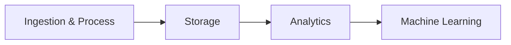
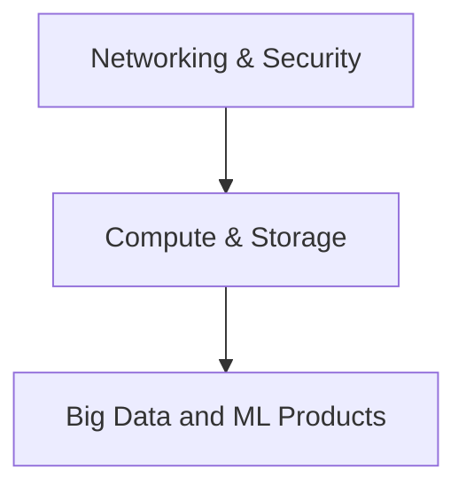
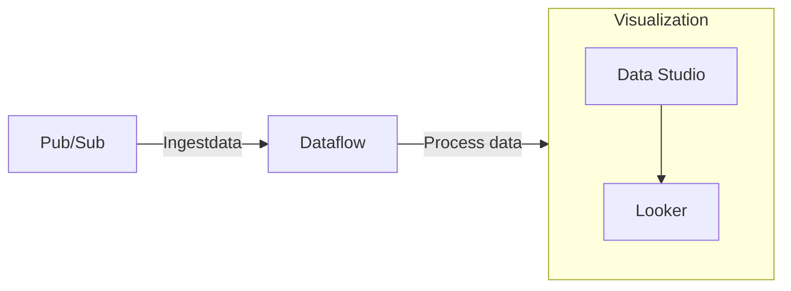

This is a Study note from Google Machine Learning Engineer certificate program. 

# Big Data and Machine Learning on Google Cloud

## Data-to-AI workflow

An ML engineer must supervise the whole ML cycle, composed of <mark style="background: #ABF7F7A6;">4 main steps</mark>: Data Ingestion & Processing, Storage, Analytics, and Machine Learning.

  

Also, a Machine Learning Engineer must consider three main elements to employ machine learning techniques successfully.

### Compute 
The following is the list of "compute" services provided by Google.
1. Compute Engine
2. Google Kubernetes Engine (GKE)
3. App Engine
4. Cloud Functions
5. Cloud Run

### Storage
The following is the list of "storage" services provided by Google.
1. Cloud Storage 
2. Cloud Bigtable
3. Cloud SQL
4. Cloud Spanner: Scalable relational database.
5. Firestore
6. BigQuery

## History of Big data
Data became large, fast-changing, and varied, or the so-called 4Vs, due to the spread of the WWW

Thus, Google created a new data processing method GFS (google file system). At the same time, Google had to deal with increased index large-scale data MapReduce. In 2010 Colossus replaced GFS. 

  

## Data types
* Unstructured Vs. Structured
	* Unstructured = Nontabular form = Better to store in cloud storage
		

  			
		

	  
	* Structured   
		

  			
		

		* Transactional workload 
			* Fast data insert and update (snapshot of existing data)
			* `[Row-based records]`
		* Analytical workload 
			* Entire datasets need to be read.
			* Complex Queries

## BigQuery 
* Querying  Public data
* Creating a custom table 
* Loading data into a table 
* Querying a table
----

# Data Engineering for Streaming Data

goal: building a real-time data solution with Google Cloud products and services.
This process involves

## What is streaming data?
Another way of classifying data is by its ingestion frequency. In this regard, we can classify the data into two classes: `streaming` and `batch data`. 
* `Batch data` is when data is loaded in one batch (a big chunk of data) 
* On the other hand, we can load the data in real-time a.k.a `streaming data`

The type of data matters since the processing is different depending on the type of data. 

### Data processing
* Batch processing
	* It is when <mark style="background: #BBFABBA6;">processing</mark> and <mark style="background: #FF5582A6;">analysis</mark> happen on a set of stored data. 

* Streaming data processing
	* data is analyzed in near real-time

Modern data processing is highly inclined to stream data processing
	Batch processing < Streaming data processing

### Challenges of Big Data
#### 4Vs
Big Data is Varied, Voluminous, Fast, and Different in Quality.
* Variety: various formats, various sources
* Volume: Scale
* Velocity: Processed in near real-time
* Veracity: Data quality
^3a2584

## Message oriented-architecture (Ingestion)
Challenges during the data ingestion process
* data can be streamed from many different methods and devices
* it can be hard to distribute event messages to the right subscribers
* data can arrive quickly and at high volumes
* ensuring services are reliable, secure and perform as expected

### Pub/Sub
Thus, google introduced `Pub/Sub` to handle distributed message-oriented architectures at scale
* A distributed messaging service that receives message from multiple sources
	* Source data -> Pub/Sub (read, store, broadcast)
	* We can think of a device that receive signals (read), stores is, and broadcast it. 

  

## Streaming pipelines with Apache Beam (Create Pipeline)
Once the data is ingested, Dataflow <mark style="background: #FF5582A6;">creates a pipeline</mark> to process *batch* and *streaming* data. 
> ❗ process = Extract, Transform, Load (ETL)

### Questions to be considered when designing pipeline
	1. Will the pipeline code be compatible with both batch and streaming data or will it need to be refactored?
	2. Will the pipeline code software development kit, or SDK, being used have all the transformations, mid-flight aggregations and windowing and be able to handle late data?
	3. Are there existing templates or solutions that should be referenced?

### Apache Beam
Apache Beam is used to design streaming pipeline. 
* Open source, unified programming model to define and execute data processing pipelines, including ETL, batch and streaming processing. 
Advantages: Unified, portable, extensible, pipeline templates, SDK(software development kit), model representation

## Implementing streaming pipelines on Cloud Dataflow
### DataFlow (Processing pipelines)
Is a fully managed service for <mark style="background: #FFB86CA6;">Implementing data processing Apache Beam pipelines</mark>
Dataflow is `serverless` and `NoOps`in other words guarantees more time analyzing and less time provisioning.
> NoOps means:
> 	Does not require management from operation teams
> 	Maintenance, monitoring, and scaling are automated. 
> Serverless means:
> 	cloud computing execution model
> 	Google manages infrastructure on behalf of the user

  

### How data flow works?
As soon as a new job is received it 1) optimizes the pipeline models execution, 2) it schedules out distributed work to new workers and 3) scales if needed. After that it 4) auto-heal any faults, and rebalances the work for an optimal work 5) and Compute & storage

Dataflow has something called `templates` to cover common use cases:
1. Streaming template
	* Pub/Sub to BigQuery
	* Pub/Sub to Cloud Storage
	* Cloud Storage to Big Query
	* Cloud Spanner to Cloud Storage
2. Batch template
	* BigQuery to Cloud Storage
	* Bigtable to Cloud Storage
	* Cloud Storage to BigQuery
	* Cloud Spanner to Cloud Storage
3. utility templates
	* Bulk Compression of Cloud Storage files 
	* Firestone bulk delete
	* File format conversion

## Data Visualization with Looker
* Allow developers to define a semantic modeling layer on top of databases
* Defines logic and permissions independent from a specific database or SQL
## Data Visualization with Data Studio
* Integrated into BigQuery 
---

# Big Data with BigQuery

BigQuery has two main services: Fully-managed `Storage` and a Fast SQL-based `analytics` engine. It is also Serverless, and Pay-as-you-go. It has data encryption at rest by default, and  Built-in machine learning. 

* Big Query = fully managed data warehouse. 

## Data solution Architecture

  

* Dataflow is the place to ETL (Extract, Transform, and Load)

The big query can:
* ingest datasets from various sources 
	* Internal data
	* External data 
	* multi-cloud data
	* public dataset
* query external data sources

### Three types of data loading
Batch Load Vs. Streaming Vs. Generated Data

  

### Big Query Analytics types
Big Query Analytics provides:
* Ad hoc Analysis 
* Geospatial analytics 
* Building Machine Learning models 
* Building BI dashboards

### BigQuery query types
Interactive queries vs. Batch queries

  

## Data Warehouse vs. Data Lake

## BigQuery ML
BigQuery started as a Data warehouse service. 
> `Data Lake` is: a pool of raw, unorganized, and unclassified data, which has no specified purpose
> `Data Warehouse` is: structured and organized data, which can be used for advanced querying

However, it developed into an ML-integrated service that allows the creation and executes machine learning models in BigQuery using SQL queries. 

❓ The reason behind the integration of ML features is to overcome the traditional burdens in the ML process. 

> Standard ML procedure 
> 	1. Export data from the datastore into IDE (Integrated Development Environment)
> 	2. Transform data + Feature Engineering
> 	3. Build model in TF + Train in VM or locally

However, BigQuery ML only requires two steps
1. Create a model 
2. Write a SQL prediction query

## Big Query ML project phases
1. Extract, transform, and load data
2. Select and process features
3. Create a Model 
4. Evaluate performance 
5. Use a model to make predictions